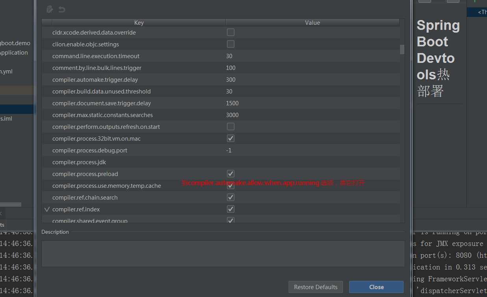

## Spring Boot Devtools热部署

* 平日里开发项目中，修改了Java代码或者配置文件的时候，必须手动重启项目才能生效。所谓的热部署就是在你修改了后端代码后不需要手动重启，工具会帮你快速的自动重启是修改生效。其深层原理是使用了两个ClassLoader，一个Classloader加载那些不会改变的类（第三方Jar包），另一个ClassLoader加载会更改的类，称为restart ClassLoader，这样在有代码更改的时候，原来的restart ClassLoader 被丢弃，重新创建一个restart ClassLoader，由于需要加载的类相比较少，所以实现了较快的重启时间。
 
  本文将介绍如何通过使用Spring-Boot-devtools来实现Spring Boot项目的热部署。IDE使用的是Eclipse Oxygen，并且使用Maven构建。
  
  * 设置步骤 
 
 
 
 
 
 
 * 引入Devtools
   搭建一个简单的Spring Boot项目，然后引入Spring-Boot-devtools：
  ``` 
     <dependency>
         <groupId>org.springframework.boot</groupId>
         <artifactId>spring-boot-devtools</artifactId>
         <optional>true</optional>
     </dependency>

  ```

* devtools会监听classpath下的文件变动，并且会立即重启应用（发生在保存时机），因为其采用的虚拟机机制，该项重启是很快的。

在Eclipse中生效还需要修改spring-boot-maven-plugin插件：

```  
<build>
    <plugins>
        <plugin>
            <groupId>org.springframework.boot</groupId>
            <artifactId>spring-boot-maven-plugin</artifactId>
            <configuration>
                <fork>true</fork>
            </configuration>
        </plugin>
    </plugins>
</build>
```
