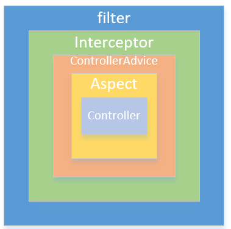

## Spring Boot中使用过滤器和拦截器 

* 过滤器（Filter）和拦截器（Interceptor）是Web项目中常用的两个功能， 

* 配置方式一
  可通过在TimeFilter上加上如下注解：
 ```  
   @Component
   @WebFilter(urlPatterns = {"/*"})
   public class TimeFilter implements Filter {
      ...
   }
 ``` 
 
 * @Component注解让TimeFilter成为Spring上下文中的一个Bean，@WebFilter注解的urlPatterns属性配置了哪些请求可以进入该过滤器，/*表示所有请求。
   
* 启动项目时可以看到控制台输出了过滤器初始化，启动后访问 http://localhost:8080/user/1，控制台输出如下：

 ``` 
    开始执行过滤器
    1
    【过滤器】耗时 31
    结束执行过滤器

 ```   


* 配置方式二
  除了在过滤器类上加注解外，我们也可以通过FilterRegistrationBean来注册过滤器。
  
  定义一个WebConfig类，加上@Configuration注解表明其为配置类，然后通过FilterRegistrationBean来注册过滤器: 
  
  ``` 
  @Configuration
  public class WebConfig {
      @Bean
      public FilterRegistrationBean timeFilter() {
          FilterRegistrationBean filterRegistrationBean = new FilterRegistrationBean();
          TimeFilter timeFilter = new TimeFilter();
          filterRegistrationBean.setFilter(timeFilter);
          List<String> urlList = new ArrayList<>();
          urlList.add("/*");
          filterRegistrationBean.setUrlPatterns(urlList);
          return filterRegistrationBean;
      }
  } 
  
  ```

* 可看到过滤器要先于拦截器执行，晚于拦截器结束。下图很好的描述了它们的执行时间区别： 
